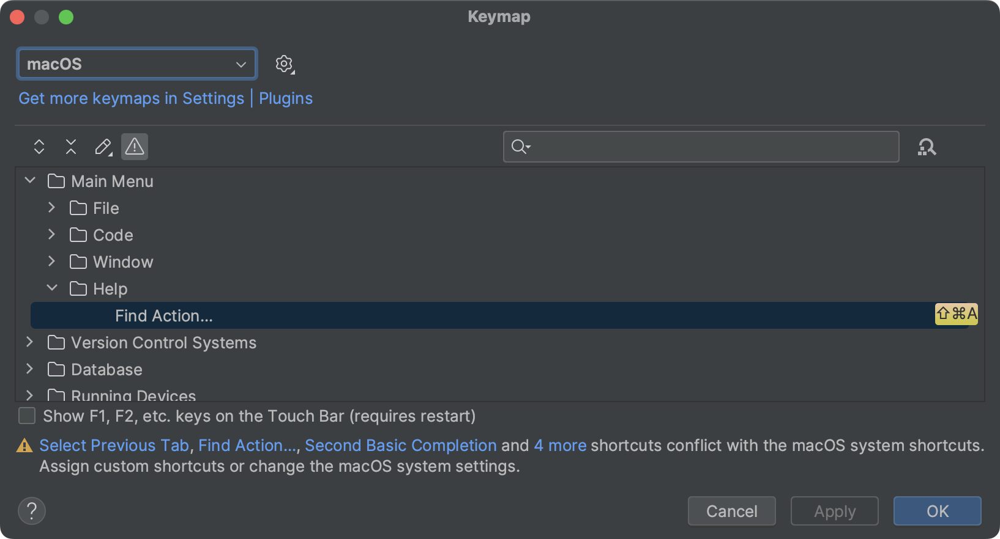
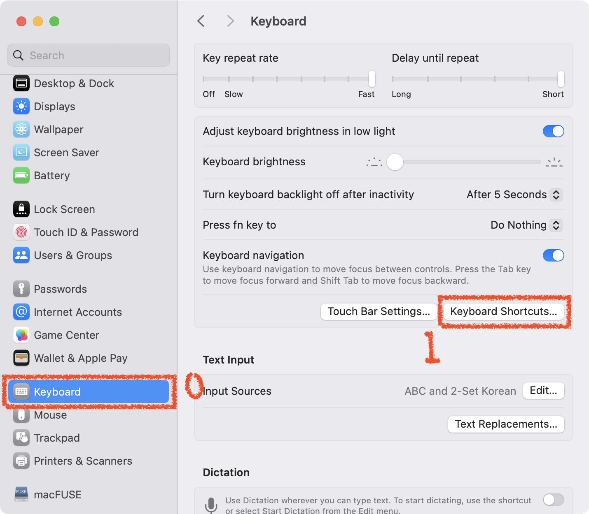
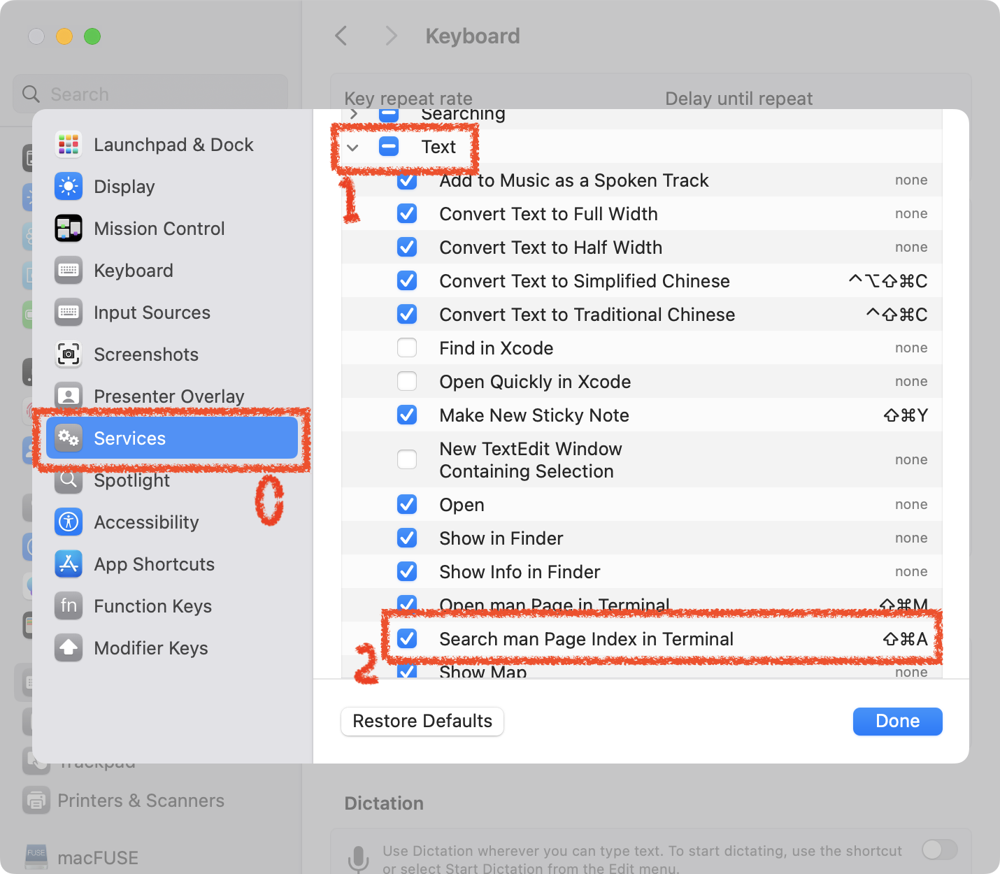

# SOLUTION INTELLIJ SHORTCUT CONFLICT

_IntelliJ_ 단축키 충돌 문제를 해결하는 방법을 알아봅니다.

인텔리제이를 사용한지 일주일 정도가 넘은 시점에서 발생한 경고입니다. \
최신버전의 인텔리제이는 키 기능이 오버라이드 되어 있어서 충돌이 발생하지 않습니다. \
사용에 문제가 없면 경고 메시지를 무시하면 됩니다.

## ENVIRONMENT

- macOS 14.0(Sonoma)
- IntelliJ IDEA Ultimate 2023.2.2
  - New UI
    - Compact mode

## PROBLEM


단축키 충돌이라는 경고가 떳습니다.

## SOLUTION

### INTELLIJ



_Modify Shorcuts_ 링크를 통해 _Keymap_ 을 확인해보니 확인해보니 <kbd>⇧</kbd> + <kbd>⌘</kbd> + <kbd>A</kbd> 단축키가 충돌이 났습니다.

### MACOS, SONOMA

먼저 설정앱을 실행합니다.

0. **설정 화면** :

   

   0. _Keyboard_ 메뉴 클릭
   1. _Keyboard Shortcuts_ 버튼 클릭

1. **키보드 단축키 화면** :

   

   0. _Services_ 메뉴 클릭
   1. _Text_ 항목 클릭
   2. _Search man Page Index in Terminal_ 항목을 **체크 해제**

## WHAT IS _SEARCH MAN PAGE INDEX IN TERMINAL_?


이 기능은 선택한 텍스트를 터미널에서 매뉴얼 옵션으로 전달하는 역할을 합니다. \
그리고 매뉴얼이 시스템에 있다면 출력됩니다.

그러나 _man_ 옵션에 전달인자가 _sudo;type=a_ 로 잘못 전달 되어 매뉴얼을 찾지 못하고 매뉴얼이 없다고 출력합니다.

**실행가능한 명령어** :

```text
man sudo;type=a
```

아무런 문제 없이 매뉴얼이 출력됩니다.

**오류가 발생하는 명령어(추측)** :

```text
man "sudo;type=a"
```

단축키로 실행했을 때와 똑같은 텍스트를 출력합니다.
