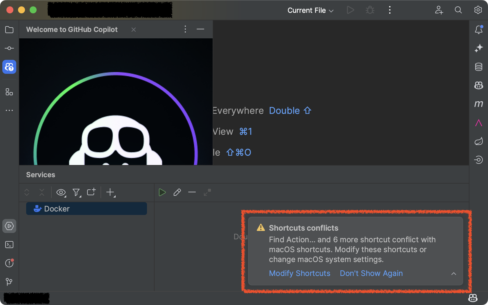
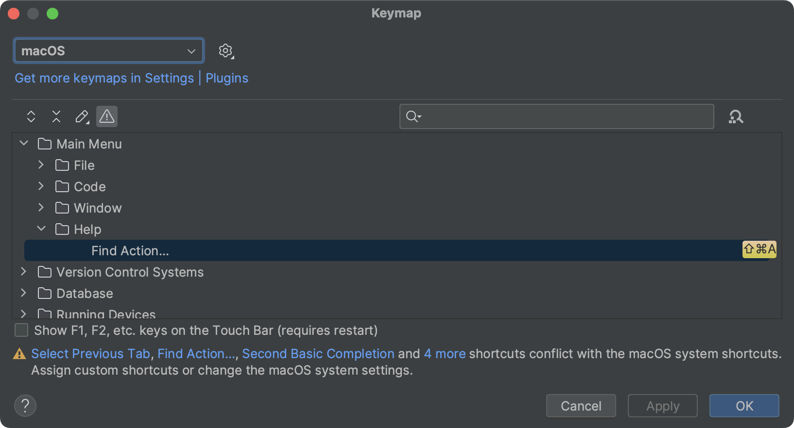
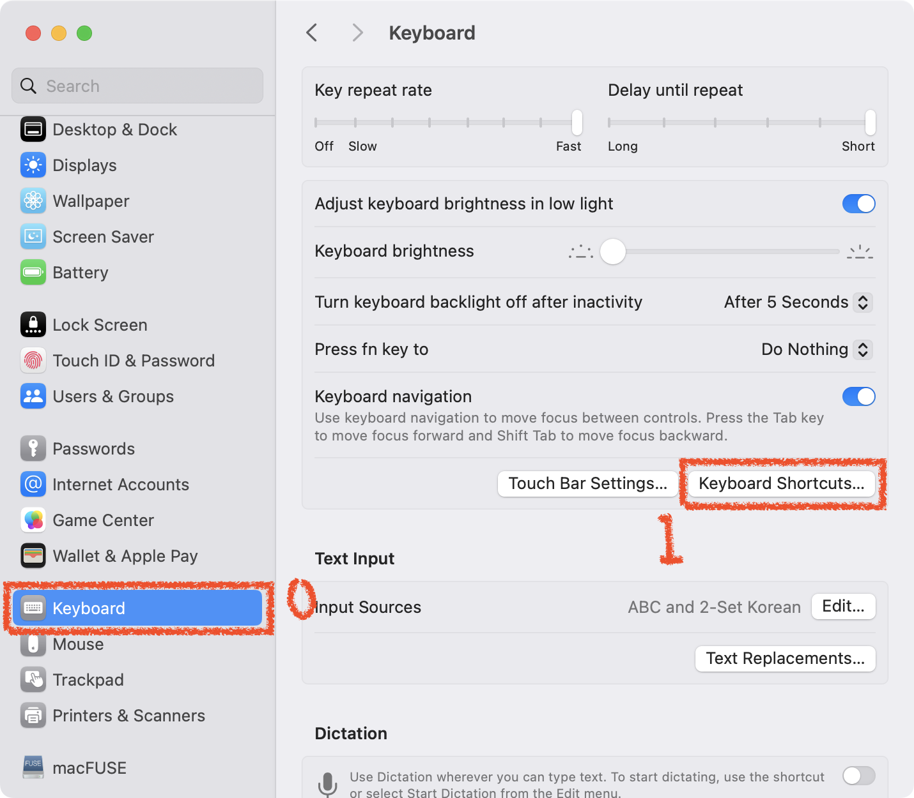

---
authors:
  - XIYO
  - XIYO
  - XIYO
  - XIYO
  - XIYO
  - XIYO
  - XIYO
  - XIYO
  - XIYO
  - XIYO
dates:
  - '2024-09-10T20:23+0900'
  - '2024-08-11T03:10+0900'
  - '2024-08-11T00:26+0900'
  - '2024-08-09T19:22+0900'
  - '2024-03-23T22:30+0900'
  - '2024-03-12T20:50+0900'
  - '2023-12-26T22:11+0900'
  - '2023-10-27T14:19+0900'
  - '2023-10-27T13:25+0900'
  - '2023-10-27T13:20+0900'
messages:
  - ':art: 리소스 경로를 규격에 맞게 통일'
  - 'Revert ":truck: 포스트 데이터 이동"'
  - ':truck: 포스트 데이터 이동'
  - ':art: 프리티어 실행'
  - ':truck: 마크다운 파일명 변경 및 구조 변경'
  - ':lipstick: 스벨트킷으로 변경'
  - ':truck: unix-and-unix-like -> xnix'
  - "\U0001F69A 파일명을 타이틀과 일치"
  - ✏️ intelliJ -> intellij 소문자로 변경
  - "\U0001F331  인텔리제이 단축키 충돌"
title: SOLUTION INTELLIJ SHORTCUT CONFLICT
---
# SOLUTION INTELLIJ SHORTCUT CONFLICT

_IntelliJ_ 단축키 충돌 문제를 해결하는 방법을 알아봅니다.

인텔리제이를 사용한지 일주일 정도가 넘은 시점에서 발생한 경고입니다. \
최신버전의 인텔리제이는 키 기능이 오버라이드 되어 있어서 충돌이 발생하지 않습니다. \
사용에 문제가 없면 경고 메시지를 무시하면 됩니다.

## ENVIRONMENT

- macOS 14.0(Sonoma)
- IntelliJ IDEA Ultimate 2023.2.2
  - New UI
    - Compact mode

## PROBLEM



단축키 충돌이라는 경고가 떳습니다.

## SOLUTION

### INTELLIJ



_Modify Shorcuts_ 링크를 통해 _Keymap_ 을 확인해보니 확인해보니 <kbd>⇧</kbd> + <kbd>⌘</kbd> + <kbd>A</kbd> 단축키가 충돌이 났습니다.

### MACOS, SONOMA

먼저 설정앱을 실행합니다.

0. **설정 화면** :

   

   0. _Keyboard_ 메뉴 클릭
   1. _Keyboard Shortcuts_ 버튼 클릭

1. **키보드 단축키 화면** :

   

   0. _Services_ 메뉴 클릭
   1. _Text_ 항목 클릭
   2. _Search man Page Index in Terminal_ 항목을 **체크 해제**

## WHAT IS _SEARCH MAN PAGE INDEX IN TERMINAL_?


이 기능은 선택한 텍스트를 터미널에서 매뉴얼 옵션으로 전달하는 역할을 합니다. \
그리고 매뉴얼이 시스템에 있다면 출력됩니다.

그러나 _man_ 옵션에 전달인자가 _sudo;type=a_ 로 잘못 전달 되어 매뉴얼을 찾지 못하고 매뉴얼이 없다고 출력합니다.

**실행가능한 명령어** :

```text
man sudo;type=a
```

아무런 문제 없이 매뉴얼이 출력됩니다.

**오류가 발생하는 명령어(추측)** :

```text
man "sudo;type=a"
```

단축키로 실행했을 때와 똑같은 텍스트를 출력합니다.
